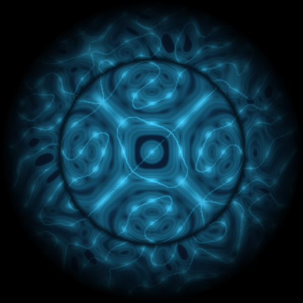
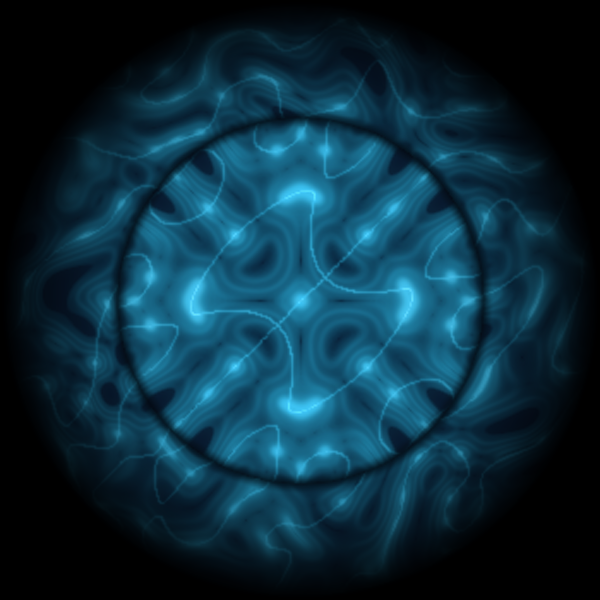
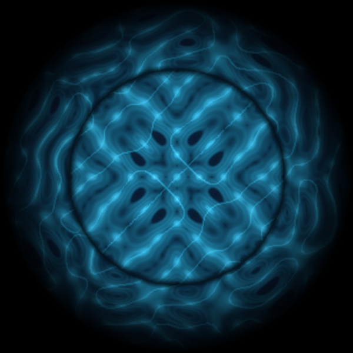

# Cymatics — Sound-Driven Pattern Generation & Analysis Pipeline

Big Data Management project that turns audio into visual **cymatics** patterns — the geometric standing-wave figures sound produces on a vibrating plate — extracts acoustic features and multi-modal embeddings, and organizes everything into a governed, queryable **data lakehouse** with a Streamlit consumption dashboard.

<p align="center">
  
  <br>
  <em>A cymatics pattern rendered by <code>shared/cymatics_engine.py</code> from a warm-path microphone recording.</em>
</p>

> **Full technical report:** [`docs/BDM_Final.pdf`](docs/BDM_Final.pdf) — the P2 (Final) deliverable for the *Big Data Management* course, MSc in Data Science, Universitat Politècnica de Catalunya (UPC). The report carries the complete design write-up, results and figures; this README is the short practical guide to understanding and running the system.

## What it does

- **Ingests** sound through four paths — live microphone (warm & hot/streaming) and batch datasets (Freesound API, ESC-50).
- **Renders** each recording into a cymatics **image + video** and detects its peak frequency.
- **Enriches** it with spectral/timbral **features** and three modality-specific **embeddings** (audio, text, cymatics).
- **Serves** the curated data as KPIs, similarity / pattern / semantic **search** and two trained **classifiers**, behind a Streamlit dashboard.
- **Governs** it with data-quality checkpoints, role-based access, cross-zone lineage and a DCAT catalog.

The design is **object-storage-centric**: MinIO is the store for every zone, Spark runs the distributed batch processing, Delta Lake is the analytical table format, Milvus holds embeddings for ANN search, Kafka carries the hot-path stream, and Airflow + a Python orchestrator drive scheduled and manual runs. Every service except the host-side orchestrator runs in Docker and is reproducible from a clean clone.

## Ingestion paths

| Path | Source | Description |
|---|---|---|
| **Warm** | Microphone | Record a 5s clip, preview the cymatics pattern, approve/reject, then store the audio. |
| **Hot** | Microphone → Kafka | A producer streams live previews and uploads a clip every 5s; a consumer archives the Kafka events. |
| **Cold — Freesound** | [Freesound](https://freesound.org) API | Batch ingest of labelled environmental sounds (incremental via a checkpoint). |
| **Cold — ESC-50** | [ESC-50](https://github.com/karolpiczak/ESC-50) | Batch ingest of the 50-class environmental-sound benchmark. |

## Lakehouse zones

| Zone | Structured storage | Vectors | Processing | What happens |
|---|---|---|---|---|
| **Landing** | CSV / Parquet / Delta | — | Python, Kafka | Raw WAV + one metadata row per UUID. |
| **Trusted** | CSV / Parquet / Delta | — | Spark, Python | Dedup + schema; render 2048×2048 PNG + MP4 + quality scores. |
| **Exploitation** | CSV / Parquet / Delta | Milvus (3 collections) | Spark, Python, PyTorch | 8 spectral + MFCC/harmonic features; embeddings; classifier heads. |
| **Consumption** | KPIs / dashboard | Milvus ANN | Pandas, Streamlit | KPIs, search and classification (analyst read-only). |

Embeddings live in three Milvus collections (HNSW / COSINE): `sound_audio_embeddings` (PANNs CNN14, 2048-d), `sound_text_embeddings` (all-MiniLM-L6-v2, 384-d) and `sound_cymatics_embeddings` (CLIP ViT-B/32, 512-d).

<p align="center">
  
  
  <br>
  <em>More warm-path frames — the plate's two-zone interference pattern shifts as the sound's spectrum changes.</em>
</p>

## Prerequisites

- **Docker** + **Docker Compose** (MinIO, Kafka, Airflow, Milvus, Spark, Streamlit, SonarQube)
- **Python 3.10+** and **ffmpeg**
- A **microphone** (for the warm / hot paths and audio / cymatics search)

## Quick Start

```bash
# 1. Configure — set FREESOUND_API_KEY, MinIO/Airflow creds, role keys, ...
cp env.example .env

# 2. Install host-side deps (orchestrator + consumption layer)
pip install -r requirements.txt

# 3. Start the stack (build the Airflow image the first time)
docker compose build      # first run only
docker compose up -d

# 4. Create the MinIO IAM roles (first run only)
python governance/data_security.py   # choose [1] Apply security policies

# 5. Run the pipelines
python orchestrate.py     # interactive menu + live CPU/RAM monitor
```

Services once up: MinIO `:9001` · Kafka UI `:8085` · Spark `:8081` · Attu/Milvus `:3000` · Airflow `:8080` · Streamlit `:8501` · SonarQube `:9090`.

The **orchestrator** (`orchestrate.py`) exposes every flow — the four ingestion paths, trusted & exploitation processing, data consumption, governance and SonarQube. Each stage can also be run directly:

```bash
python landing_zone/warm_path/landing_zone_warm.py        # warm path (mic → preview → store)
python trusted_zone/trusted_zone_processing.py            # Spark clean + cymatics render
python exploitation_zone/exploitation_zone_processing.py  # features + embeddings + classifiers
streamlit run data_consumption/data_consumption_all.py    # unified dashboard
```

Or schedule them via Airflow (`:8080`): `cold_freesound_ingestion` (weekly), `trusted_zone_processing` (biweekly), `exploitation_zone_processing` (every 15 days). See `env.example` for all environment variables.

## Repository layout

```
landing_zone/       # warm / hot / cold ingestion paths
trusted_zone/       # Spark cleaning + cymatics PNG/MP4 + peak metadata
exploitation_zone/  # spectral/MFCC features, Milvus embeddings, classifier heads
data_consumption/   # KPIs, similarity/pattern/semantic search, Streamlit dashboard
governance/         # data quality, MinIO IAM, lineage, DCAT catalog
shared/             # cymatics engine, freq detection, MinIO + Delta helpers
docker/ kafka/ minio/   # infrastructure config
docs/               # final report (PDF + LaTeX) and figures
orchestrate.py      # CLI orchestrator with resource monitor
docker-compose.yml  # full stack
```

## Authors

- Arman Bazarchi
- Brisa Fernanda Cisneros Cervantes
