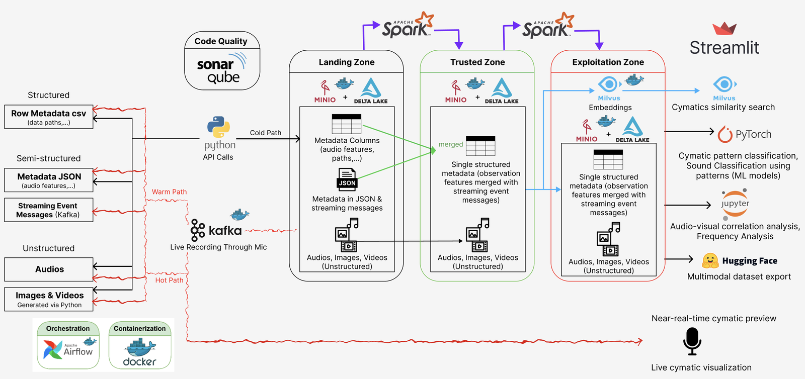
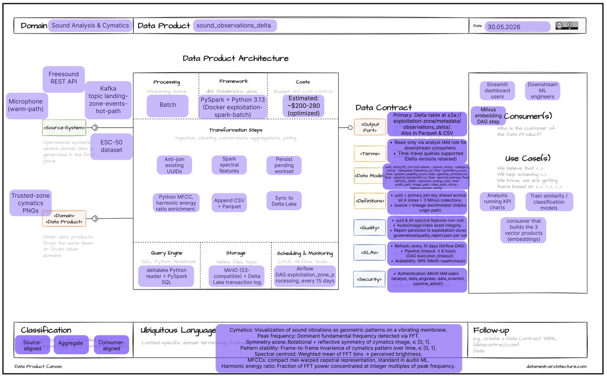
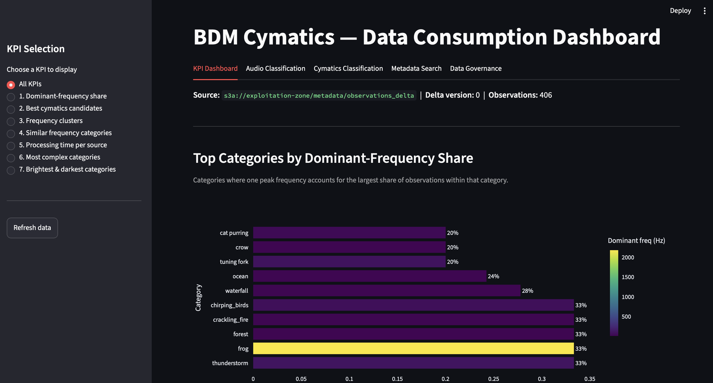
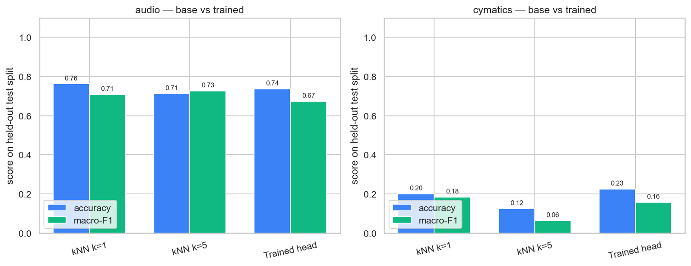
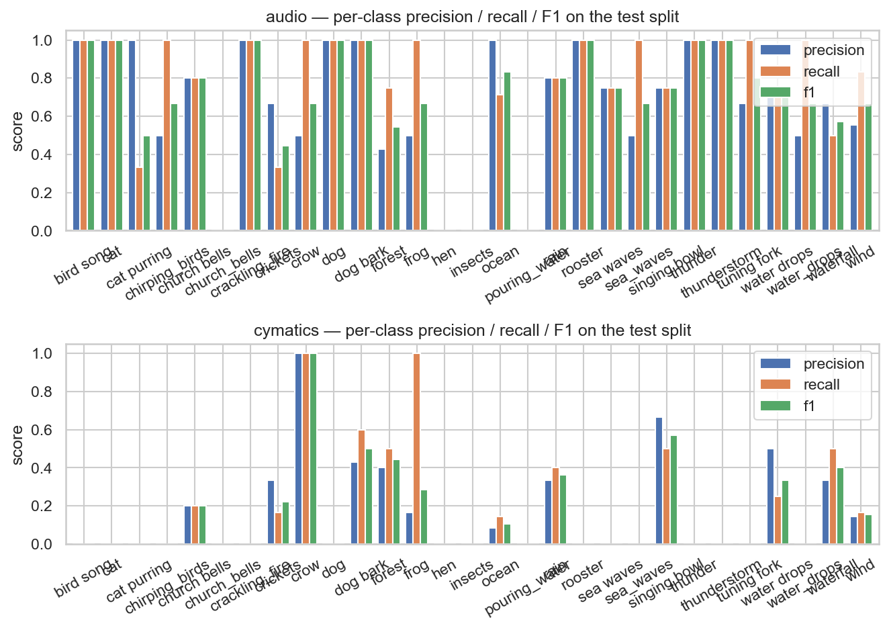

# Cymatics — Sound-Driven Pattern Generation & Analysis Pipeline

Big Data Management project that transforms audio files into visual **cymatics** patterns (the geometric standing-wave figures that sound produces on a vibrating membrane), extracts acoustic features, generates audio / text / image embeddings, and organizes all artifacts into a structured, queryable data lakehouse with governance, role-based access and a Streamlit consumption dashboard.

> **Full technical report:** [`docs/BDM_Final.pdf`](docs/BDM_Final.pdf) — the P2 (Final) deliverable for the *Big Data Management* course, Master's in Data Science, Universitat Politècnica de Catalunya (UPC). This README expands on that report and mirrors its figures. Where the report and code differ in wording, the code and this README are authoritative for running the system.

**Business domain:** *Sound Analysis & Cymatics* — make audio observations and their visual cymatics representations **searchable, classifiable and analyzable**.

## Table of Contents

**Concepts (from the report)**

1. [Overview](#overview)
2. [Problem and Goals](#problem-and-goals)
3. [Datasets and Sources](#datasets-and-sources)
4. [Architecture and Technology Stack](#architecture-and-technology-stack)
5. [Data Pipeline and Zones](#data-pipeline-and-zones)
6. [Data Model and Data Products](#data-model-and-data-products)
7. [Data Consumption: KPIs and Analytics](#data-consumption-kpis-and-analytics)
8. [Results and Findings](#results-and-findings)
9. [Data Governance](#data-governance)
10. [Design Decisions and Challenges](#design-decisions-and-challenges)
11. [Conclusions and Future Work](#conclusions-and-future-work)

**Getting started (how to run)**

12. [Prerequisites](#prerequisites)
13. [Quick Start](#quick-start)
14. [Environment Variables](#environment-variables)
15. [Embeddings and Milvus Collections](#embeddings-and-milvus-collections)
16. [Trained Classifier Heads](#trained-classifier-heads)
17. [SonarQube (Code Quality)](#sonarqube-code-quality)
18. [Repository Layout](#repository-layout)
19. [MinIO Bucket Layout](#minio-bucket-layout)
20. [Authors](#authors)

---

## Overview

Cymatics is an end-to-end big-data pipeline that turns raw sound into an analyzable, multi-modal dataset. Every audio observation is ingested through one of four paths, cleaned and rendered into a cymatics **image** and **video** with quality metrics, enriched with spectral and timbral **features**, and embedded into three modality-specific **vector** spaces. The curated data is then served through pre-defined KPIs, similarity/pattern search, semantic metadata search and two trained classifiers, all behind a unified Streamlit dashboard and governed by data-quality, security, lineage and catalog mechanisms.

The system follows the **object-storage-centric** architecture (Option 1 in the project statement) and partially incorporates the **vector-database** approach (Option 2) for the exploitation zone. MinIO is the central object store; Apache Spark performs distributed batch processing; Delta Lake is the analytical storage format for structured metadata at every stage; Milvus stores embeddings for approximate-nearest-neighbour (ANN) search; Kafka transports the hot-path event stream; and Airflow plus a custom Python orchestrator drive scheduled and manual runs. The project is fully self-contained and reproducible from a clean clone — every service except the host-side Python orchestrator runs inside Docker.

## Problem and Goals

Sound is rich and high-dimensional, but its *visual* structure (cymatics) and its *acoustic* structure are rarely captured, curated and made queryable together. The goal of this project is to build a reproducible big-data platform that:

- **Ingests** environmental/musical sounds from batch datasets, live microphone capture and a streaming path.
- **Curates** them through a landing → trusted → exploitation zone lakehouse, keeping raw assets and typed tabular metadata side by side.
- **Enriches** each recording with cymatics renderings, spectral/timbral features and multi-modal embeddings.
- **Serves** the curated data for analytics (KPIs), similarity/pattern search, semantic search and supervised classification.
- **Governs** the whole platform with data-quality checkpoints, role-based access control, cross-zone lineage and a machine-readable catalog.

## Datasets and Sources

Observations enter the **landing zone** through four ingestion paths, recorded in a controlled `source` vocabulary (`warm-path`, `hot-path`, `cold-Freesound`, `cold-ESC-50`):

| Path | Source | Description |
|---|---|---|
| **Warm path** | Microphone | Record a 5-second clip, preview the cymatics pattern, approve/reject, then store the audio. |
| **Hot path** | Microphone → Kafka | A producer streams live cymatics previews and uploads a clip every 5 s; a parallel consumer archives the Kafka events into the landing zone. |
| **Cold path — Freesound** | [Freesound](https://freesound.org) REST API | Batch ingestion of labelled environmental sounds (requires `FREESOUND_API_KEY`); supports incremental ingestion via a checkpoint. |
| **Cold path — ESC-50** | [ESC-50](https://github.com/karolpiczak/ESC-50) dataset | Batch ingestion of the 50-class environmental-sound benchmark (auto-downloaded if missing). |

Unstructured assets (WAV audio, and the later PNG/MP4 renders) are stored in MinIO under deterministic paths keyed by **peak frequency** and **UUID**, which groups related observations for downstream visual and acoustic analysis. PANNs CNN14 (used later for audio embeddings) is pretrained on **AudioSet**, which aligns well with the kinds of sounds ingested here (animals, water, fire, etc.).

## Architecture and Technology Stack



*Architecture of the Cymatics pipeline: ingestion paths (cold/warm/hot) feed the Landing → Trusted → Exploitation zones on MinIO + Delta Lake, with Spark batches between zones, Milvus embeddings in the exploitation zone, Airflow/Docker orchestration, SonarQube code quality, and a Streamlit consumption layer.*

Each zone has its own MinIO bucket holding both **unstructured assets** and a **tabular metadata table** materialised as CSV, Parquet and a Delta Lake table. Embeddings — inherently high-dimensional and frequently queried by ANN — live in a dedicated Milvus instance backed by its **own** MinIO (`milvus-minio`), keeping them isolated from curated data. Code quality is tracked by SonarQube, wired into the orchestrator so a single command produces a fresh report for the `bdm-cymatics` project.

| Layer | Structured storage | Vector storage | Processing |
|---|---|---|---|
| **Landing** | CSV / Parquet / Delta | — | Python, Kafka |
| **Trusted** | CSV / Parquet / Delta | — | Spark, Python |
| **Exploitation** | CSV / Parquet / Delta | Milvus (3 collections) | Spark, Python, PyTorch |
| **Consumption** | KPIs / dashboard | Milvus ANN search | Pandas, Streamlit, PyTorch |

**Technology roles:** MinIO (S3-compatible object store per zone) · Apache Spark (distributed batch cleaning + spectral features) · Delta Lake (typed analytical tables) · Milvus + Attu (vector DB + admin UI) · Kafka + Kafka UI (hot-path event stream) · Apache Airflow (scheduled DAGs) · custom Python `orchestrate.py` (manual runs + live CPU/RAM monitor) · Streamlit (unified consumption + governance dashboard) · SonarQube (code quality) · PostgreSQL (Airflow & SonarQube metadata). See the [containerised services table](#quick-start) for endpoints.

## Data Pipeline and Zones

### Landing Zone

Raw observations land untouched, one metadata row per UUID plus the original WAV. Cold-path rows carry API/dataset metadata; hot-path rows also carry the Kafka streaming-event payload (timestamps, device identifiers), which is archived here and flattened later. Metadata is written as CSV, Parquet and a Delta table; Freesound ingestion keeps a checkpoint file for incremental pulls.

### Trusted Zone

The trusted zone transforms raw observations into clean, schema-aligned records using only **information-preserving, reversible** transformations (task-specific assumptions are deferred to later zones). It runs in **two stages**:

1. **Spark batch** (`trusted-spark-batch` container) — reads the landing CSV through the S3A connector, **deduplicates on the UUID primary key** against existing trusted metadata, enforces the trusted schema, merges the Kafka event metadata for hot-path rows, and writes the pending UUIDs to a workset on MinIO.
2. **Per-row Python stage** — for each pending UUID, downloads the audio, invokes the cymatics rendering engine (`shared/cymatics_engine.py`) to produce a **2048×2048 PNG** and an **MP4**, computes two cymatics quality metrics — `symmetry_score` and `pattern_stability_score` (both in `[0, 1]`) — and appends the new records to CSV, Parquet and Delta.

Assets are stored under `audio/`, `images/`, `videos/` grouped by peak frequency and UUID; metadata lives under `metadata/`. The Delta table uses a **typed schema** (`shared/sync_delta.py`) — floats for scores/durations, ints for byte sizes, strings for IDs/paths — added specifically to overcome the all-strings default of reading from CSV. Generating the cymatics assets once here avoids regenerating identical artifacts downstream.

### Exploitation Zone

The exploitation zone curates trusted data into a **single wide, pre-joined table** (every trusted attribute joined with the features derived here), removing the need for joins at consumption time and reducing query complexity and latency. The pipeline chains six steps:

1. **Spark batch** (`spark_exploitation_zone.py`) extracts **eight global spectral descriptors**.
2. **Python per-row features**: MFCC coefficients (13-dim timbral fingerprint) and the harmonic-energy ratio (tonal vs. inharmonic) — computed in Python because they involve per-frame state unsuited to Spark.
3. Append new rows to CSV and Parquet.
4. Sync Parquet → Delta with the typed per-zone schema.
5. Build/update the **three Milvus collections** (idempotent upsert keyed on UUID).
6. Train and persist the **classifier heads** for the audio and cymatics modalities.

| Spark spectral descriptor | Brief overview |
|---|---|
| `spectral_centroid_hz` | "Centre of mass" of the spectrum; higher = brighter sound. |
| `spectral_bandwidth_hz` | Spread of the spectrum around the centroid. |
| `spectral_rolloff_hz` | Frequency below which the bulk of the signal sits. |
| `spectral_flatness` | ~1 = noise-like content, ~0 = tonal content. |
| `signal_energy` | Sum of squared samples; coarse loudness/length proxy. |
| `spectral_entropy` | High = complex/noise-like, low = simple/tonal. |
| `zero_crossing_rate` | Average sign changes per second. |
| `loudness` | Energy in decibels (dBFS). |

The three Milvus collections share an HNSW index with cosine similarity (`M=16`, `efConstruction=256`); see [Embeddings and Milvus Collections](#embeddings-and-milvus-collections) for models and dimensions.

### Consumption

The consumption layer reads the exploitation-zone Delta table through **analyst-only** (read-only) S3 credentials and queries the three Milvus collections through their ANN interface. See [Data Consumption](#data-consumption-kpis-and-analytics).

## Data Model and Data Products

The exploitation zone materialises **five data products** so the governance layer can attach policies, owners and quality checks at the granularity of a single product:

| Data product | Type | Storage | Owner | Primary consumer(s) |
|---|---|---|---|---|
| `sound_observations_delta` | structured | Delta Lake on MinIO | `pipeline_admin` | KPI discovery, Streamlit, lineage |
| `sound_audio_embeddings` | vector (2048-d, PANNs CNN14) | Milvus (HNSW/COSINE) | `data_scientist` | audio classification + similarity search |
| `sound_text_embeddings` | vector (384-d, all-MiniLM-L6-v2) | Milvus (HNSW/COSINE) | `data_scientist` | metadata semantic search (RAG-ready) |
| `sound_cymatics_embeddings` | vector (512-d, CLIP ViT-B/32) | Milvus (HNSW/COSINE) | `data_scientist` | cymatics pattern search + head training |
| `classifier_models` | model registry | MinIO object store | `data_scientist` | audio & cymatics classification |

The analytical center of the domain is the `sound_observations_delta` product — a single denormalised observation row per UUID. Its data-product canvas (domain, sources, transformation steps, storage, data contract, consumers and ubiquitous language) is shown below:



*Data-product canvas for `sound_observations_delta`: batch (PySpark + Python) transformation steps, MinIO/Delta storage, a typed data contract refreshed every 15 days, and downstream analytics/ML consumers.*

**`sound_observations_delta` schema:**

| Column | Type | Group |
|---|---|---|
| `uuid` | string | Identifier (primary key) |
| `category` | string | Supervised label used by KPIs and classifier heads |
| `peak_frequency_hz` | float64 | Trusted-zone peak-frequency statistic |
| `peak_time_s` | float64 | Trusted-zone peak-frequency statistic |
| `peak_amplitude` | float64 | Trusted-zone peak-frequency statistic |
| `peak_rms` | float64 | Trusted-zone peak-frequency statistic |
| `all_peak_frequencies_hz` | string | List of harmonics, kept as text |
| `symmetry_score` | float64 | Cymatics quality score in `[0, 1]` |
| `pattern_stability_score` | float64 | Cymatics quality score in `[0, 1]` |
| `spectral_centroid_hz` | float64 | Spark spectral feature |
| `spectral_bandwidth_hz` | float64 | Spark spectral feature |
| `spectral_rolloff_hz` | float64 | Spark spectral feature |
| `spectral_flatness` | float64 | Spark spectral feature |
| `signal_energy` | float64 | Spark spectral feature |
| `spectral_entropy` | float64 | Spark spectral feature |
| `zero_crossing_rate` | float64 | Spark spectral feature |
| `loudness` | float64 | Spark spectral feature |
| `MFCCs` | string | JSON-encoded 13-dim vector (Python feature) |
| `harmonic_energy_ratio` | float64 | Python feature |
| `audio_path` | string | Trusted-zone WAV location |
| `image_path` | string | Trusted-zone PNG location |
| `video_path` | string | Trusted-zone MP4 location |

**Data contracts (per product):** the structured product guarantees a typed, fixed schema refreshed every 15 days with Great-Expectations quality checks (non-null UUID, no duplicates, scores in `[0, 1]`, valid asset paths). Each vector product guarantees L2-normalised, non-zero vectors of the exact declared dimensionality, idempotent upsert keyed on UUID, and HNSW/cosine indexing; the text product additionally bounds descriptions to ≤ 4096 characters. The `classifier_models` product guarantees a non-empty class list, a complete metrics report and a `model_version`.

## Data Consumption: KPIs and Analytics

Four downstream tasks are exposed both as CLI flows (orchestrator option 8) and as tabs in the unified Streamlit dashboard (`data_consumption/data_consumption_all.py`), on top of the same Python functions.



*The Streamlit data-consumption dashboard (KPI view), reading the exploitation-zone Delta table with analyst read-only credentials.*

**KPI discovery** — seven predefined queries over the exploitation-zone Delta table, each returned as a Pandas frame rendered as a chart and offered as a CSV download:

| ID | Query | Brief overview |
|---|---|---|
| KPI 1 | Top categories by frequency share | Categories ranked by how dominant their most-repeated peak frequency is within the class. |
| KPI 2 | Best cymatics candidates | Top recordings ranked by a combined cymatics quality score. |
| KPI 3 | Top categories per frequency band | Within each low / mid / high frequency band. |
| KPI 4 | Spectrally similar categories | Pairs of categories with the closest mean peak frequencies. |
| KPI 5 | Processing time per ingestion source | Average trusted-zone processing duration grouped by ingestion path. |
| KPI 6 | Spectral complexity per category | Categories ranked by mean spectral entropy (high = noise-like, low = tonal). |
| KPI 7 | Brightest vs. darkest categories | Categories with the highest and lowest mean spectral centroid. |

**Audio similarity search** — record 5 s from the microphone, compute the 2048-d PANNs CNN14 embedding, feed it to the trained audio head for a prediction, and run an ANN search against `sound_audio_embeddings` to return the top-*k* acoustically similar recordings as supporting evidence. Falls back gracefully to pure ANN search when no trained model is available.

**Cymatics pattern search** — three modes in the CLIP ViT-B/32 space: **upload an image**, **record audio** (renders a cymatics image, then embeds it), or **type a natural-language description** (text-to-image). Image/audio modes feed the 512-d embedding to the trained cymatics head (predicted category + confidence) plus an ANN search over stored image embeddings; the text mode is retrieval-only.

**Metadata semantic search** — each observation is summarized as a short natural-language description, embedded with all-MiniLM-L6-v2 and stored in Milvus; a user query is embedded with the same model and matched by cosine similarity. This lightweight retrieval layer is RAG-ready.

## Results and Findings

The exploitation pipeline closes with a lightweight supervised step (`classifier_training.py`): a logistic-regression head fitted on top of the **frozen** PANNs and CLIP embeddings to predict each observation's `category`. Training uses an **80/20** train/test split with **5-fold** stratified cross-validation and `class_weight="balanced"` to handle Freesound class imbalance, and runs only when at least two categories have ≥ 3 samples. Only the audio and cymatics modalities are trained (text is excluded because its description embeds the category). The reported evaluation trains a small batch (**~400 records**; 406 observations in the demo dataset) and compares the trained head against two kNN retrieval baselines (k=1, k=5) on a held-out test split.



*Base vs. trained — accuracy and macro-F1 on the held-out test split, for audio (left) and cymatics (right).*

- **Audio (PANNs CNN14, 2048-d):** all three methods perform similarly — kNN k=1 **0.76** acc / **0.71** macro-F1, kNN k=5 **0.71** / **0.73**, trained head **0.74** / **0.67** — showing the frozen PANNs embeddings already separate the acoustic classes effectively.
- **Cymatics (CLIP ViT-B/32, 512-d):** performance stays near chance for every method — kNN k=1 **0.20** / **0.18**, kNN k=5 **0.12** / **0.06**, trained head **0.23** / **0.16** — suggesting CLIP does not capture cymatics patterns well and that larger training data or encoder fine-tuning would be required.



*Per-class precision, recall and F1 on the held-out test split — audio (top) is consistently strong across most classes; cymatics (bottom) is weak on many classes.*

The audio model is consistently strong across most classes, with variation only in underrepresented categories that have few test samples. The cymatics model performs poorly on many classes, reinforcing that a larger training set or a more specialized approach is needed.

## Data Governance

The exploitation zone is governed at the **data-product** level (see [Data Model and Data Products](#data-model-and-data-products)). Four governance mechanisms ship with the project; each runs via the orchestrator (option 9) and via the Streamlit dashboard.

- **Data quality — Great Expectations** (`governance/data_quality.py`) — three checkpoints aligned with the zone boundaries:
  - **Landing → Trusted:** `uuid` non-null and unique; `peak_frequency_hz` strictly positive; `source` in the allowed vocabulary (`warm-path`, `hot-path`, `cold-Freesound`, `cold-ESC-50`); the WAV exists in MinIO with a valid RIFF/WAVE header and non-zero size.
  - **Trusted → Exploitation:** all trusted attributes present, asset paths valid, each cymatics image a readable 2048×2048 PNG and each video a non-empty MP4.
  - **Milvus:** vectors have the declared dimensionality, are L2-normalised and not all-zero.
- **Data security — MinIO IAM** (`governance/data_security.py`) — four roles with a bucket-level access matrix, applied with `mc admin` inside the MinIO container (the Python SDK only supports bucket-level policies, not user management). Pipeline scripts authenticate as `pipeline_admin`; the dashboard and consumption tasks use read-only `analyst` credentials, enforced at the application level to prevent accidental writes. The audit report is stored in the `governance-zone` bucket.

  | Role | Landing | Trusted | Exploitation | Governance |
  |---|---|---|---|---|
  | `pipeline_admin` | RW | RW | RW | RW |
  | `data_engineer` | RW | RW | R | R |
  | `data_scientist` | — | R | RW | R |
  | `analyst` | R | R | R | R |

- **Lineage tracking** (`governance/lineage_tracker.py`) — a UUID-indexed table tracing every observation across the three zones and three Milvus collections: which zones contain it, which assets were generated (WAV / PNG / MP4 / audio / text / cymatics embeddings), processing timestamps and a completeness flag. It is recomputed from existing metadata (no extra storage; full scans get expensive as the dataset grows). Example chain for one `sea_waves` recording ingested via ESC-50, at 100% completeness:

  ```
  Stages:  landing -> trusted -> exploitation   [####################] 100%
    -> Ingested via ESC-50 -> landing-zone audio
    -> Spark QA (dedup, schema) -> trusted-zone (image + video + peak detection, v2.0.0)
    -> Spark spectral features + Python MFCCs -> exploitation-zone (v1.0.0)
    -> PANNs CNN14      -> audio embedding    (2048-dim)
    -> all-MiniLM-L6-v2 -> text embedding     (384-dim)
    -> CLIP ViT-B/32    -> cymatics embedding  (512-dim)
  ```

- **Data catalog — DCAT** (`governance/data_catalog.py`) — registers the five data products in a machine-readable catalog kept as an object in the governance bucket (consistent with the object-storage-centric design), rather than deploying a heavyweight server such as Apache Atlas (no native connectors for MinIO/Delta/Milvus). It emits a readable JSON registry and a **DCAT** (W3C Data Catalog Vocabulary) JSON-LD document where each product is a `dcat:Dataset`, and displays each product's live health.

## Design Decisions and Challenges

- **Object-storage-centric + partial vector DB.** Option 1 (MinIO across zones) is combined with Option 2 (Milvus for the exploitation zone) so high-dimensional embeddings get purpose-built ANN indexing without giving up the simple object-store lakehouse for everything else.
- **Pre-joined wide exploitation table.** A single denormalised table removes consumption-time joins, lowering query complexity and latency — a good fit for the single-observation-per-UUID scope.
- **Tabular over semi-structured for Kafka events.** Hot-path events are archived in the landing zone, then flattened and merged into the tabular trusted schema; since the Kafka message schema is small and stable (timestamps, device IDs), a separate semi-structured store was unnecessary.
- **Typed Delta schema.** A per-zone typed cast (`shared/sync_delta.py`) was introduced specifically to overcome the all-strings default produced when reading from CSV.
- **Isolated Milvus storage.** Milvus runs against its own `milvus-minio`, which simplifies governance/access control and lets the vector stack be reset or maintained without touching curated data.
- **`mc admin` for IAM.** User/role management is done through the MinIO admin CLI because the Python SDK only supports bucket-level policies; the trade-off is maintaining two credential pairs (`pipeline_admin` RW, `analyst` RO) in the environment.
- **Thin linear classifier head.** A `StandardScaler → LogisticRegression` head on frozen embeddings was chosen over a deeper from-scratch model because, at the current data scale, a non-linear head would overfit.
- **Catalog as an object, not Apache Atlas.** Keeping a DCAT JSON-LD catalog in the governance bucket avoids adding heavy backing services with no native MinIO/Delta/Milvus connectors; the trade-off is that the static registry must be updated when a new product is added.
- **Cymatics assets generated once.** Rendering the 2048×2048 PNG and MP4 in the trusted zone avoids regenerating identical assets for every downstream task.

## Conclusions and Future Work

The platform demonstrates a reproducible, governed, multi-modal sound-and-cymatics lakehouse: ingestion (cold/warm/hot) → trusted cleaning + cymatics rendering → exploitation features + embeddings + classifiers → consumption (KPIs, search, classification) → governance (quality, security, lineage, catalog), automated through Airflow and a Python orchestrator.

Key takeaways and directions:

- **Audio** classification and similarity search already work well off frozen PANNs CNN14 embeddings.
- **Cymatics** visual classification remains near chance with off-the-shelf CLIP; a larger training set and/or encoder fine-tuning (or a more specialized visual model) is the main avenue for improvement.
- The **text** embeddings provide a lightweight retrieval layer that can back a **RAG-style chatbot** over the metadata in future work.

---

## Prerequisites

- **Docker** and **Docker Compose** (for MinIO, Kafka, Zookeeper, Airflow, Milvus, Spark, Streamlit, SonarQube)
- **Python 3.10+**
- **ffmpeg** (for audio decoding in cold path)
- A microphone (for warm path, hot path, audio similarity search and cymatics search)

## Quick Start

### 1. Environment setup

```bash
cp env.example .env
# Edit .env — set FREESOUND_API_KEY, MINIO credentials, Airflow credentials, role-based keys, ...
```

### 2. Install Python dependencies

```bash
pip install -r requirements.txt
```

### 3. Start infrastructure

```bash
# Build custom Airflow image (first time only)
docker compose build

# Start all services
docker compose up -d
```

This starts:

| Service | Endpoint | Purpose |
|---|---|---|
| **MinIO** | http://localhost:9001 | Object store for all zones |
| **Zookeeper + Kafka + Kafka UI** | http://localhost:8085 | Hot-path event streaming |
| **Spark master + 2 workers + history** | http://localhost:8081 | Distributed batch processing |
| **Milvus + Attu** | http://localhost:3000 | Vector store + admin UI |
| **Airflow webserver + scheduler** | http://localhost:8080 | DAG-based scheduling |
| **Streamlit dashboard** | http://localhost:8501 | Unified consumption + governance UI |
| **SonarQube** | http://localhost:9090 | Code quality (first boot ~1 min) |
| **PostgreSQL** (Airflow, SonarQube) | — | Metadata DBs |

### 4. Apply MinIO access policies (first run only)

The pipeline scripts authenticate against MinIO with the `pipeline_admin` role and the consumption layer with the `analyst` role declared in `.env`. Those IAM users do **not** exist on a fresh MinIO, so before running any ingestion you must create them once:

```bash
python governance/data_security.py
# choose [1] Apply security policies
```

This provisions the four roles (`pipeline_admin`, `data_engineer`, `data_scientist`, `analyst`) with the bucket-level RW/R/no-access matrix described in the report. You only need to do this again if you wipe MinIO (`docker compose down -v` plus `rm -rf minio/*`).

### 5. Run pipelines

#### Option A: Manual Orchestrator (recommended)

```bash
python orchestrate.py
```

Interactive menu with live CPU/RAM monitoring. Supports all flows:

| # | Flow | Description |
|---|------|-------------|
| 1 | Warm path | Record 5s → preview cymatics → approve/reject → store audio |
| 2 | Hot path | Producer (live viz + Kafka) + consumer in parallel |
| 3 | Cold: Freesound | Batch ingest from Freesound API |
| 4 | Cold: ESC-50 | Batch ingest from ESC-50 dataset |
| 5 | Trusted zone | Spark cleaning + cymatics PNG/MP4 + peak metadata |
| 6 | Exploitation zone | Spark spectral features → Python MFCC/harmonic → Milvus embeddings → classifier-head training |
| 7 | SonarQube | Run `sonar-scanner` against this repo and print quality metrics |
| 8 | Data consumption | Sub-menu: KPI discovery, audio search, cymatics search, metadata search, Streamlit |
| 9 | Data governance | Sub-menu: Great Expectations checkpoints, MinIO RBAC, lineage tracking |

> Delta Lake sync runs automatically at the end of each zone’s processing script — no separate menu entry. Milvus embedding ingestion **and classifier-head training** are part of the exploitation-zone flow.

#### Option B: Run scripts directly

**Warm path** (records from microphone, user approval):

```bash
python landing_zone/warm_path/landing_zone_warm.py
```

**Hot path** (two terminals):

```bash
# Terminal 1 — consumer (waits for Kafka messages)
python landing_zone/hot_path/landing_zone_hot_consumer.py

# Terminal 2 — producer (live cymatics + uploads every 5s)
python landing_zone/hot_path/landing_zone_hot_producer.py
```

**Cold path — Freesound** (batch, prompts for batch size):

```bash
python landing_zone/cold_path/cold_freesound.py 50
```

**Cold path — ESC-50** (batch, prompts for batch size):

```bash
python landing_zone/cold_path/cold_esc50.py 50
```

**Trusted zone** (Spark cleaning + cymatics image/video + peak metadata):

```bash
python trusted_zone/trusted_zone_processing.py
```

**Exploitation zone** (Spark spectral features → Python MFCC/harmonic → Milvus embeddings → classifier-head training):

```bash
docker compose up -d
python exploitation_zone/exploitation_zone_processing.py
# Spark-only batch: docker compose run --rm exploitation-spark-batch
# Re-run Milvus ingestion only: python exploitation_zone/milvus_embeddings.py
# Re-train classifier heads only: python exploitation_zone/classifier_training.py
```

**Delta sync** (runs automatically at the end of each zone; manual override):

```bash
python shared/sync_delta.py              # all zones
python shared/sync_delta.py trusted      # one zone
```

**Data consumption tasks** (each module also runs through the orchestrator or the Streamlit dashboard):

```bash
python data_consumption/tasks/discover_kpis.py          # KPI catalogue
python data_consumption/tasks/audio_classification.py    # mic → PANNs → trained head + Milvus ANN evidence
python data_consumption/tasks/cymatics_classification.py # image/audio/text → CLIP → trained head + Milvus ANN evidence
python data_consumption/tasks/search_metadata.py         # natural-language metadata search (retrieval only)
streamlit run data_consumption/data_consumption_all.py   # unified dashboard
```

**Governance tasks**:

```bash
python governance/data_quality.py     # Great Expectations checkpoints (Landing → Trusted → Exploitation → Milvus)
python governance/data_security.py    # MinIO IAM: 4 roles, bucket-level policies
python governance/lineage_tracker.py  # cross-zone lineage table per UUID
python governance/data_catalog.py     # DCAT data-product catalog with live health
```

#### Option C: Airflow (automated scheduling)

Open http://localhost:8080, log in with `AIRFLOW_USERNAME`/`AIRFLOW_PASSWORD` from `.env`, and unpause DAGs:

- `cold_freesound_ingestion` — weekly, up to 250 new Freesound sounds into landing-zone.
- `trusted_zone_processing` — every 2 weeks, full Spark + Python trusted pipeline (deduplicates on UUIDs already in trusted metadata).
- `exploitation_zone_processing` — every 15 days (first run 15 days after trusted anchor), Spark + Python exploitation pipeline + Milvus embedding ingestion (anti-join on exploitation UUIDs).

## Environment Variables

See `env.example` for all options:

| Variable | Default | Description |
|----------|---------|-------------|
| `MINIO_ENDPOINT` | `localhost:9000` | MinIO API endpoint |
| `MINIO_ACCESS_KEY` | `admin` | MinIO root access key (used when role-based keys are unset) |
| `MINIO_SECRET_KEY` | `password` | MinIO root secret key |
| `MINIO_PIPELINE_ACCESS_KEY` / `MINIO_PIPELINE_SECRET_KEY` | — | RW credentials used by ingestion / Spark / exploitation scripts |
| `MINIO_ANALYST_ACCESS_KEY` / `MINIO_ANALYST_SECRET_KEY` | — | Read-only credentials used by data consumption + Streamlit |
| `LANDING_ZONE_BUCKET` | `landing-zone` | Landing-zone object-store bucket |
| `TRUSTED_ZONE_BUCKET` | `trusted-zone` | Trusted-zone object-store bucket |
| `EXPLOITATION_ZONE_BUCKET` | `exploitation-zone` | Exploitation-zone object-store bucket |
| `KAFKA_BOOTSTRAP_SERVERS` | `localhost:9092` | Kafka broker |
| `MILVUS_HOST` | `localhost` | Milvus host |
| `MILVUS_PORT` | `19530` | Milvus gRPC port |
| `FREESOUND_API_KEY` | — | Freesound API key ([get one](https://freesound.org/apiv2/apply/)) |
| `ESC50_BASE_PATH` | — | Local ESC-50 path (auto-downloads if missing) |
| `AIRFLOW_USERNAME` / `AIRFLOW_PASSWORD` | `admin` / `admin` | Airflow web UI credentials |
| `SONAR_TOKEN` | — | SonarQube user token (preferred for scans) |
| `SONAR_USERNAME` / `SONAR_PASSWORD` | `admin` / `admin` | Fallback scanner login |
| `SONAR_JDBC_USERNAME` / `SONAR_JDBC_PASSWORD` | `sonar` / `sonar` | PostgreSQL credentials for the SonarQube container |

## Embeddings and Milvus Collections

The exploitation pipeline materialises three Milvus collections (HNSW / COSINE, `M=16`, `efConstruction=256`), all keyed on UUID with idempotent upsert:

| Collection | Model | Dim | Use case |
|---|---|---|---|
| `sound_audio_embeddings` | PANNs CNN14 | 2048 | Audio similarity search + feature input for the trained audio classifier head |
| `sound_text_embeddings` | all-MiniLM-L6-v2 | 384 | Natural-language metadata search (RAG-ready) |
| `sound_cymatics_embeddings` | CLIP ViT-B/32 | 512 | Image / audio / text → cymatics pattern search + feature input for the trained cymatics classifier head |

Inspect collections through Attu at http://localhost:3000.

## Trained Classifier Heads

The exploitation pipeline closes by training two logistic-regression heads on top of the frozen PANNs and CLIP embeddings (audio and cymatics modalities only — text is excluded because its description embeds the category). Each head is a `StandardScaler → LogisticRegression(class_weight="balanced")` pipeline fitted with a stratified 80/20 hold-out split + 5-fold stratified cross-validation and persisted to MinIO with a JSON model card:

```
exploitation-zone/models/
├── audio_classifier.joblib          # joblib-serialised sklearn pipeline
├── audio_classifier.metrics.json    # model card: CV + test accuracy / F1, per-class P/R, CM, model_version
├── cymatics_classifier.joblib
└── cymatics_classifier.metrics.json
```

Training is gated on having at least 2 categories with ≥3 samples each, so it skips cleanly on tiny datasets. The validation notebook (`exploitation_zone/notebooks/classifier_validation.ipynb`) renders generalisation plots (base-vs-trained comparison, per-class metrics, learning curves, confusion matrices) and saves the headline figures to `docs/`. See [Results and Findings](#results-and-findings) for the measured accuracy/F1 and the base-vs-trained comparison.

## SonarQube (Code Quality)

SonarQube tracks **bugs**, **vulnerabilities**, **code smells**, **duplication**, and **maintainability** so you can prioritize refactors and harden the Python pipelines over time. Configuration lives in `sonar-project.properties` (project key `bdm-cymatics`, Python sources and sensible exclusions for `data/`, `venv/`, etc.).

1. **Start the server** (if it is not already up from `docker compose up -d`):

   ```bash
   docker compose up -d sonarqube
   ```

   Open http://localhost:9090, complete the first-time setup if prompted, and align `.env` with `env.example` for `SONAR_JDBC_*` and scanner auth.

2. **Install the scanner** on your machine (the UI alone does not analyze code):

   ```bash
   brew install sonar-scanner
   ```

   Or follow the [official SonarScanner install guide](https://docs.sonarsource.com/sonarqube/latest/analyzing-source-code/scanners/sonarscanner/).

3. **Run an analysis** from the project root:

   - **Recommended:** `python orchestrate.py` → choose **\[7\] SonarQube code analysis**. The script checks that SonarQube is ready, runs the scanner using `sonar-project.properties`, then prints a short summary and links to the full dashboard: http://localhost:9090/dashboard?id=bdm-cymatics.

   - **Manual:** after setting `SONAR_TOKEN` (or `SONAR_USERNAME` + `SONAR_PASSWORD`) in `.env`, run `sonar-scanner` in this directory.

Use the SonarQube **Issues** and **Measures** views to drive incremental improvements (fix hotspots, reduce duplication, clear security hotspots) before merging larger changes.

## Repository Layout

```
landing_zone/
├── warm_path/                       # mic → preview → approval → store
├── hot_path/                        # mic → Kafka producer + consumer
├── cold_path/                       # Freesound + ESC-50 batch ingestion
└── notebooks/

trusted_zone/
├── trusted_zone_processing.py       # Spark cleaning + cymatics PNG/MP4 + metadata persist
├── spark_trusted_zone.py            # Spark batch (dedup, schema, Kafka merge)
├── dags/                            # Airflow DAG (every 2 weeks)
└── notebooks/

exploitation_zone/
├── exploitation_zone_processing.py  # orchestrates Spark → Python → Milvus → classifier training
├── spark_exploitation_zone.py       # 8 spectral features via Spark
├── milvus_embeddings.py             # PANNs / MiniLM / CLIP → 3 Milvus collections
├── classifier_training.py           # logistic-regression heads on audio + cymatics embeddings → MinIO
├── dags/                            # Airflow DAG (every 15 days)
└── notebooks/                       # includes classifier_training.ipynb and classifier_validation.ipynb

data_consumption/
├── data_consumption_all.py          # unified Streamlit dashboard
├── tasks/
│   ├── discover_kpis.py             # KPI catalogue over exploitation Delta
│   ├── audio_classification.py      # mic → PANNs → trained head + Milvus ANN evidence
│   ├── cymatics_classification.py   # image / audio / text → CLIP → trained head + Milvus ANN evidence
│   └── search_metadata.py           # text → MiniLM → Milvus ANN (retrieval only)
└── notebooks/

governance/
├── data_quality.py                  # Great Expectations checkpoints
├── data_security.py                 # MinIO IAM (4 roles, bucket policies)
├── lineage_tracker.py               # UUID-indexed cross-zone lineage
├── data_catalog.py                  # DCAT data-product catalog + live health
└── notebooks/

shared/
├── minio_helpers.py                 # MinIO clients (pipeline/analyst) + CSV/Parquet helpers
├── sync_delta.py                    # Parquet → Delta sync with typed per-zone schema
├── cymatics_engine.py               # cymatics rendering engine
└── freq_detection.py                # peak-frequency / harmonic detection

docker/                              # Custom Dockerfiles (Airflow, Spark batches, Streamlit)
kafka/                               # Kafka config
minio/                               # MinIO config
docs/                                # Project statement, P2 final report (PDF + LaTeX), diagrams, figures/
orchestrate.py                       # CLI orchestrator with resource monitor
docker-compose.yml                   # Full stack
```

## MinIO Bucket Layout

```
landing-zone/
├── audio/
│   ├── warm-path/<peak_freq>/<uuid>-<peak_freq>.wav
│   ├── hot-path/<peak_freq>/<uuid>-<peak_freq>.wav
│   ├── Freesound/<peak_freq>/<category>_<freq>_<uuid>.wav
│   └── ESC-50/<peak_freq>/<category>_<freq>_<uuid>.wav
└── metadata/
    ├── observations.csv
    ├── observations.parquet
    ├── observations_delta/          # Delta Lake (synced with Parquet, typed schema)
    └── freesound_last_ingestion.txt # Checkpoint for incremental ingestion

trusted-zone/
├── audio/<peak_freq>/<uuid>-<peak_freq>.wav
├── images/<peak_freq>/<uuid>-<peak_freq>.png
├── videos/<peak_freq>/<uuid>-<peak_freq>.mp4
└── metadata/
    ├── observations.csv
    ├── observations.parquet
    ├── observations_delta/          # Delta Lake (typed schema)
    └── pending_workset.json         # Spark batch handoff

exploitation-zone/
├── metadata/
│   ├── observations.csv             # trusted columns + derived features
│   ├── observations.parquet
│   ├── observations_delta/          # Delta Lake (typed schema)
│   └── spark_pending_workset.json   # Spark batch handoff
└── models/                          # trained classifier heads + JSON model cards
    ├── audio_classifier.joblib
    ├── audio_classifier.metrics.json
    ├── cymatics_classifier.joblib
    └── cymatics_classifier.metrics.json

governance-zone/
├── security/
│   └── security_report.json         # data-security audit report (created by data_security.py)
└── catalog/
    ├── data_catalog.json            # readable data-product registry + live health
    └── data_catalog_dcat.jsonld     # DCAT (W3C) JSON-LD catalog (created by data_catalog.py)
```

**Feature split (exploitation zone):**

| Layer | Features |
|-------|----------|
| Spark (`spark_exploitation_zone.py`) | `spectral_centroid_hz`, `spectral_bandwidth_hz`, `spectral_rolloff_hz`, `spectral_flatness`, `signal_energy`, `spectral_entropy`, `zero_crossing_rate`, `loudness` |
| Python (`exploitation_zone_processing.py`) | `MFCCs`, `harmonic_energy_ratio` |
| Milvus (`milvus_embeddings.py`) | PANNs audio (2048-d), MiniLM text (384-d), CLIP cymatics (512-d) |
| Models (`classifier_training.py`) | `audio_classifier.joblib`, `cymatics_classifier.joblib` (logistic-regression heads on the audio and cymatics embeddings) |

## Authors

- Arman Bazarchi
- Brisa Fernanda Cisneros Cervantes
